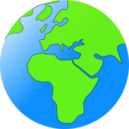

<div id="top"></div>


<!-- PROJECT LOGO -->
<br />
<div align="center">
  <a href="https://git.scc.kit.edu/synergy.o3as/o3webapp/-/blob/issue_readMe_%2365">
    
  </a>

<h3 align="center">The O3as Webapp</h3>

  <p align="center">
    he O3as Webapp has the purpose of visualizing data from the ozone layer
    and thus enhancing the scientific research of the ozone layer decomposition.
    The product provides an intuitive user interface for detailed visualizations,
    e.g. ozone recovery analysis, and calculation of statistical values. Furthermore, plotted data can be downloaded to share gathered information
  </p>
</div>

## Built With

- [node.js](https://nodejs.org/en/)
- [npm.js](https://www.npmjs.com/)
- [React.js](https://reactjs.org/)
- [Redux.js](https://redux.js.org/)
- [Jest.js](https://jestjs.io/)
- [MaterialUI](https://mui.com/)
- [axios](https://axios-http.com/docs/intro)

<p align="right">(<a href="#top">back to top</a>)</p>

## Prerequisites

Make sure that you have installed the following libaries, moduls, technologies etc.

- node.js (https://nodejs.dev/learn/how-to-install-nodejs)

- react.js (https://reactjs.org/docs/getting-started.html)

## How to Install and Run the Project

- After cloning the project execute this command in order to install the necessary packages:

```
    npm install
```

- If you want to start the App localy, execute:

```
    npm start
```

- To run the tests and to see the test coverage, execute:

```
    npm run test -- --coverage .
```

- To generate docs, execute:

```
    npm run docs
```

### Working on the VM

There is a runnig instants on the VM. You can visit the WebApp via this link: http://o3web.test.fedcloud.eu:3000/

- If you have a private key and and you want to connect to the VM where the WebApp is deployed, execute:

```
    ssh -i <your_private_key> cloudadm@o3web.test.fedcloud.eu
```

- After connecting to the VM and you want to see the logging of the application, including messages from the container, execute:

```
    sudo docker-compose -f app
```

### How to Use the Project

### Credits

### License

Add components inside to auto-generate a live UML diagram from the existing strucure.

The parser is alreay setup to generate the code from this **src/** directory and put the .txt file in the **generated-uml/** directory.

Notes on frameworks we want to use:

- React
- Redux (state handling)
- Jest (testing, also mantained by Facebook)
- React Testing Library (RTL) to test React components (recommended by React)
- Material UI (components, a lot of input components, in our experience better documented than Bootstrap)
- axios (API Calls)

Configuration can be done in the config file
The default config specifies where to put certain fields, if after calling the API it is necessary to place them somewhere.
Special config files for endpoints can be specified.
